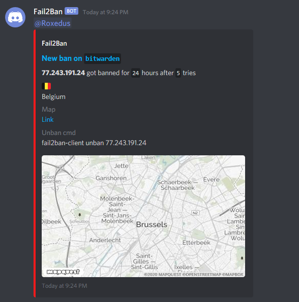

# discordEmbed

Python script adding embed-based notifications for discord to Fail2Ban.

Due to the power of f-strings, this script requires python3.6 or higher

## How to use

This script needs maxminds geolite2 database for best functionality. Get yours [here](https://dev.maxmind.com/geoip/geoip2/geolite2/)

[Discord webhook](https://support.discordapp.com/hc/en-us/articles/228383668-Intro-to-Webhooks), it just need the last parts. ```40832456738934/7DcEpWr5V24OIEIELjg-KkHky86SrOgTqA```

[Your discord ID](https://support.discordapp.com/hc/en-us/articles/206346498-Where-can-I-find-my-User-Server-Message-ID-). ```120970603556503552```

[Map API Key](https://developer.mapquest.com/) get a key from mapquest.

Arguments you can send to the action:

```py
usage: discordEmbed.py [-h] -a {unban,ban,start,stop,test} [-d DB] [-f FAIL] [-i IP] [-j JAIL] [-m MAP_KEY] [-t TIME] [-u USER] [-w HOOK]

Discord notifier for F2B

optional arguments:
  -h, --help            show this help message and exit
  -a {unban,ban,start,stop,test}, --action {unban,ban,start,stop,test}
                        Which F2B action triggered the script
  -d DB, --db DB        Location to geoip database
  -f FAIL, --fail FAIL  Amount of attempts done
  -i IP, --ip IP        Ip which triggered the action
  -j JAIL, --jail JAIL  jail which triggered the action
  -m MAP_KEY, --map-key MAP_KEY
                        API key for mapquest
  -t TIME, --time TIME  The time the action is valid
  -u USER, --user USER  Discord user, if it is a id, it will tag
  -w HOOK, --hook HOOK  Discord hook to use.
  ```

Arguments **override** enviroment variables. This means you can define annother Discord webhook or Discord user per action. (You can also use annoter map api key if  you really want)

| __Argument__  | __Eviroment Variable__ | __Description__ |
| --- | --- | :--- |
|`Action` | | Hopefully self-explainatory. **Required**|
|`DB` | `F2B_GEO_DB` | Pass this variable with the action if your geolite database is not located as `/config/geoip2db/GeoLite2-City.mmdb`. |
|`FAIL` | | This is only cosmetic, it lists the ammounts of fail-attempts invoking the ban. |
|`HOOK` | `F2B_DISCORD_HOOK` | Pass this as an argument if you want to override the channel the webhook goes to. |
|`IP` | | Used for IP lookup, and map. |
|`JAIL` | | This is only cosmetic, it identifies the jail invoking the ban. |
|`MAP_KEY` | `F2B_MAP_KEY` | Override the map key for this action. |
|`USER` | `F2B_DISCORD_USER` | Override the mentioned user for this action. Use `None` to disable |
|`TIME` | | If given a number, using `<bantime>` it will use this number to calculate the unban time. If given a string, like `24 hours`, it will not do this calculation. |

Example Ban action, where MAP_KEY, USER and HOOK is enviroment variables

```ini
actionban = python3 /config/fail2ban/Fail2Ban.py -a ban -j <name> -i <ip> -t <bantime> -f <failures> -d /config/geoip2/GeoLite2-City.mmdb
```

## Example

